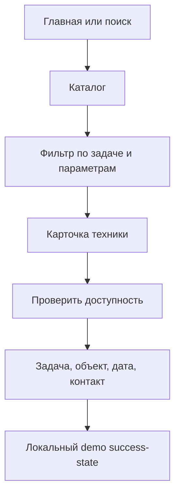
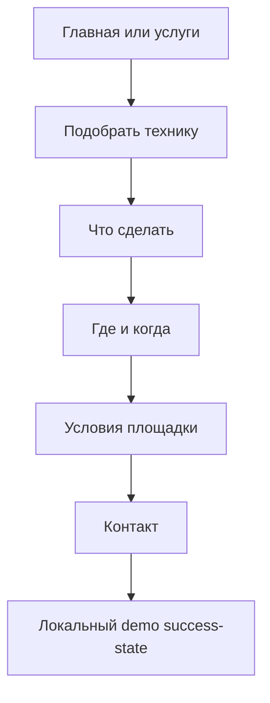

# Sitemap и ключевые UX-flow

## Information architecture

| Route | Задача страницы | Основной CTA |
|---|---|---|
| `/` | Позиционирование, быстрый выбор по задаче, популярная техника, процесс и география | Проверить доступность / Подобрать технику |
| `/catalog` | Найти и сравнить технику по рабочим параметрам | Открыть карточку / Рассчитать стоимость |
| `/catalog/[slug]` | Проверить применимость, характеристики, минимум, цену и доставку | Проверить доступность |
| `/services` | Начать с вида работ, а не названия машины | Подобрать технику |
| `/delivery` | Понять зону работы и факторы стоимости подачи | Рассчитать подачу |
| `/about` | Объяснить операционную модель fictional demo-company | Посмотреть парк |
| `/contacts` | Показать режим, зону и demo-контакты без ложной отправки | Собрать заявку |
| `/request` | Собрать структурированное ТЗ за три шага | Показать demo success-state |
| `/privacy` | Честно объяснить обработку данных в демонстрации | Вернуться к форме |

## Primary conversion flow

## Flow «не знаю, какая техника нужна»

## Mobile-first решения

- header сохраняет один явный вход в меню и предметный CTA внутри меню;
- фильтры каталога открываются как полноэкранная нижняя панель;
- detail page получает sticky bottom CTA и не прячет минимальный заказ;
- карточки показывают цену, смену и минимум до раскрытия;
- touch targets — не меньше 44–52 px;
- длинные характеристики разбиты на сканируемую сетку;
- поля используют нативные типы (`date`, `tel`) и видимые сообщения об ошибках;
- при нулевой выдаче каталог объясняет, как сбросить ограничения.

## Состояния

- navigation: current page;
- catalog: default, filtered, no results, mobile filter open;
- form: default, field error, progress, checked option, local success;
- buttons: default, hover, focus-visible;
- reduced motion: анимации практически отключаются по системной настройке.
